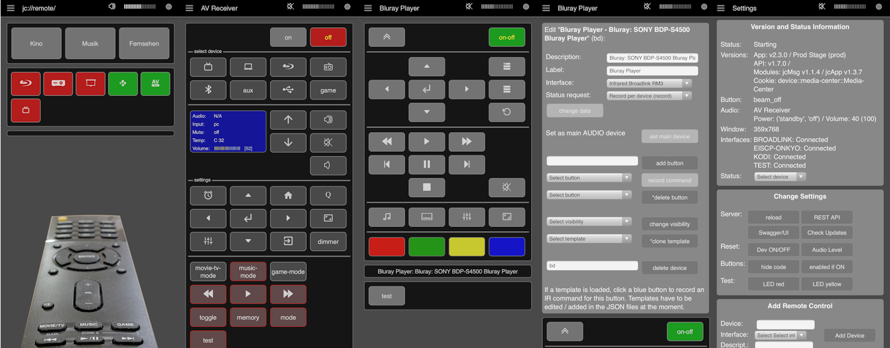
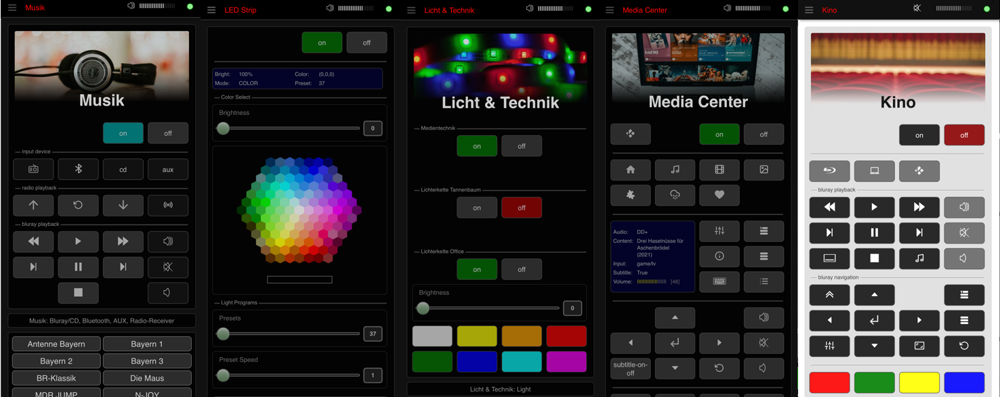
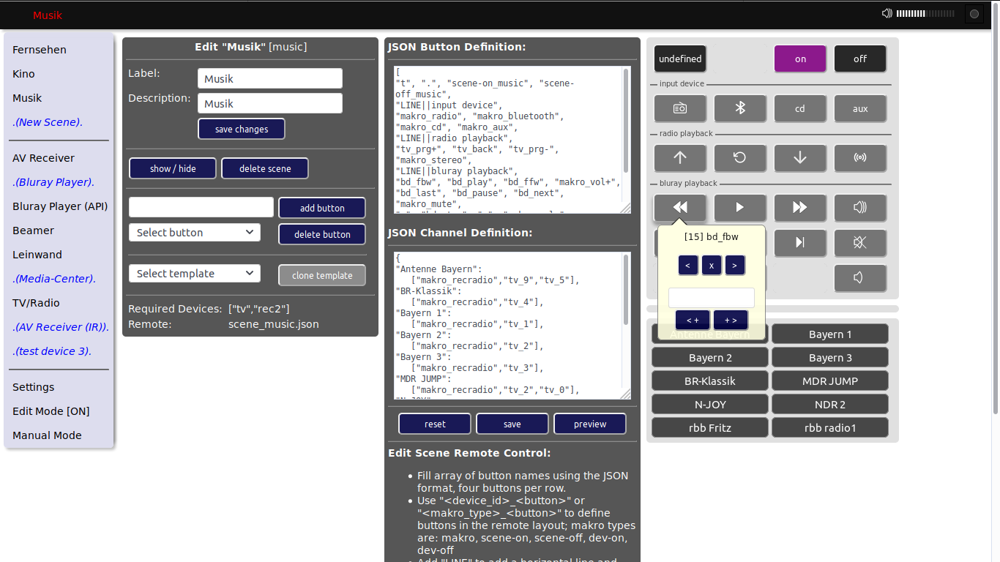

# jc://remote/

Looking a remote control to control several devices I got disappointed ... and decided to develop my own web-app running on my smartphone.
Therefore I found the **Broadlink RM 3 Mini** and sources on Github to control this IR device via API. About two years later several devices
as my new ONKYO receiver come with their own API and I started to rework my software and to integrate the first device via API directly.
In the meanwhile a few additional APIs are integrated ...

## Supported Hardware

* Broadlink RM 3 Mini - Infrared receiver/sender
* Several ONKYO devices with API (see section modelsets in the file eiscp-commands.yaml in https://github.com/miracle2k/onkyo-eiscp)
* Several SONY devices with API (see README in https://https://github.com/alexmohr/sonyapilib)
* KODI server
* Magic Home compartibel LED strips 
* Tapo SmartPlugs P100
* *Other devices easily can be integrated*

## Screenshots 


Light theme on iPhone XS


Dark theme on iPhone XS


Remotes with header and color picker (updated dark theme)


Edit remote layouts in a browser

## Data structure

* [Description of data and configuration files](data/README.md)

## Main features

### App v2.7 / Server v2.0 (in-progress)

* add remote control for LED strips compartible with MagicHome
* add remote control for Tapo SmartPlugs
* add slider and color-picker
* stablize API connections

### App v2.6 / Server v1.9

* send text input to API for KODI API
* integrate jc://modules/ as sub-module
* integrate jc://app-framework / as sub-module
* Optimize data structure (sample data files, productive files ignored by git)

### App v2.5 / Server v1.9

* add/edit/delete device remote controls via web-client
* add/edit/delete scene remote controls via web-client
* edit remote layouts including preview in the browser
* API for Sony devices (sonyapilib)
* optimized UI (e.g. menu)

### App v2.4 / Server v1.8

* stablized app and API connection incl. better performance
* integrated volume slider
* smaller UI optimizations
* start script including update from GitHub
* cleaned up code

### App v2.3 / Server v1.7

This is the first working release with stable API connection to devices:

* control devices via API (Onkyo-API, KODI)
* create and edit remote controls for devices (initial)
* record IR commands for devices
* record status for devices controlled via IR (not a direct API)
* read information for devices via API
* light / dark theme based on device preset (Safari)
* basic automatic tests (check data format, check server API requests, check Onky API)
* docker environment for app and server incl. central configuration for multiple stages

The definition of devices and scenes at the moment should be done based a set of JSON files. 
The code comes with several sample device and scene definitions that explain the possible options.
The integration of the device APIs is done in an easy way, so that the integration of additional device API should be easy also.

### App & Server 1.x

* remote control for devices
* remote control for scenes incl. makros
* control devices via IR sender/receiver (Broadlink RM3 Mini)

## Used Sources

Many thanks to the authors ...
  
* BlackBeanControl (https://github.com/davorf/BlackBeanControl)
* eiscp-onkyo (https://github.com/miracle2k/onkyo-eiscp)
* KodiJson (https://github.com/jcsaaddupuy/python-kodijson)
* SonyApiLib (https://https://github.com/alexmohr/sonyapilib)
* MagicHome API (https://github.com/adamkempenich/magichome-python)
* PyP100 API (https://github.com/fishbigger/TapoP100)
* Free icons from (https://icon-icons.com/), (https://www.freeicons.io/), (https://www.flaticon.com/), and (https://icons8.com/)
* Free images from (https://unsplash.com/)
* jc://modules/ (https://github.com/jc-prg/modules)


## How to setup the software

### Prerequisites

In order to use jc://remote/ as it is, the following software must be installed:

1. git
2. docker, docker-compose


### How to install, configure and run the software

1. Clone this repository and the modules

```bash
$ git clone https://github.com/jc-prg/remote.git
$ git submodule update --init
```

2. Change settings

```bash
$ cd remote\config
$ cp sample.config_prod config_prod
$ ./create prod
```

3. Build and start via docker-compose ..

```bash
$ cd ..
$ docker-compose build
$ ./start start
```

4. Open in browser, e.g. http://localhost:81/

5. Install via autostart - add the following line to /etc/rc.local

```bash
/<your_path_to_remote>/start start
```

6. Update from Github (works, if configuration file has not changed)

```bash
$ ./start update
```

## Disclaimer

Feel free to try and to improve ... and stay tuned.

