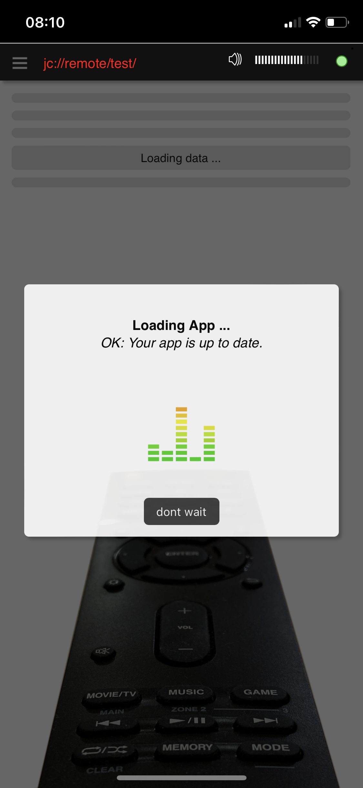
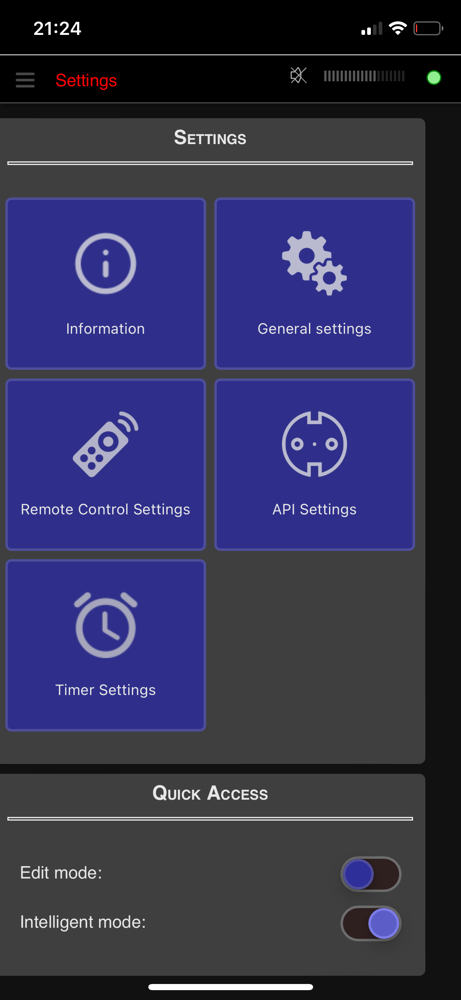

# jc://remote/

With this software you can control several **home media devices** via Infrared and API with a web-app, e.g., on your smartphone.
It requires a small server such as a Raspberry Pi and can control the hardware listed below. 
You can define remote controls for devices and create scenes that use those commands from 
those devices or macros to combine several commands on a single button. 
There are a few templates available to be used and modified.

## Table of Content

- [Currently Supported Hardware](#supported-hardware)
- [Screenshots](#screenshots)
- [Data structure](#data-structure)
- [Release notes](docs/RELEASE-NOTES.md)
- [Used sources](#used-sources)
- [How to setup the software](#how-to-setup-the-software)
- [Integration of additional APIs and devices](#integration-of-additional-apis-and-devices)
- [Disclaimer](#disclaimer)


## Currently Supported Devices and Interfaces

1. Broadlink Remote Controls  ... [API Info](./server/interfaces/broadlink/README.md)
2. DENON devices with API ... [API Info](./server/interfaces/denon/README.md)
3. KODI server  ... [API Info](./server/interfaces/kodi/README.md)
4. Magic Home compatible LED strips  ... [API Info](./server/interfaces/magichome/README.md)
5. ONKYO devices with API ... [API Info](./server/interfaces/eiscp/README.md)
6. Open Meteo Weather / PyGeo ... [API-Info](./server/interfaces/weather/README.md)
7. SONY devices with API ... [API Info](./server/interfaces/sonyapi/README.md)
8. Tapo SmartPlugs P100 ... [API Info](./server/interfaces/p100/README.md)
9. ZigBee Devices via ZigBee2MQTT API ... [API Info](./server/interfaces/zigbee/README.md)

## Screenshots

         

Find here [further screenshots](./docs/IMPRESSIONS.md) ...

## Data structure

* [Description of data and configuration files](./docs/DATA-STRUCTURE.md)

## Used sources

Many thanks to the authors ...
  
* [BlackBeanControl](https://github.com/davorf/BlackBeanControl)
* [Chart.js](https://www.chartjs.org/)
* [DenonAVR](https://github.com/ol-iver/denonavr)
* [eiscp-onkyo](https://github.com/miracle2k/onkyo-eiscp)
* [KodiJson](https://github.com/jcsaaddupuy/python-kodijson)
* [SonyApiLib](https://https://github.com/alexmohr/sonyapilib)
* [MagicHome API](https://github.com/adamkempenich/magichome-python)
* [Open Meteo](https://open-meteo.com/)
* [PyP100 API](https://github.com/fishbigger/TapoP100)
* [ZigBee2MQTT](https://www.zigbee2mqtt.io/)
* Free icons and images: https://icon-icons.com/, https://www.freeicons.io/, https://www.flaticon.com/, https://icons8.com/, https://unsplash.com/, https://chatgpt.com

Own included modules:

* [jc://modules/](https://github.com/jc-prg/modules)
* [jc://app-framework/](https://github.com/jc-prg/app-framework)


## How to setup the software

### Prerequisites

In order to use jc://remote/ as it is, the following software must be installed:

1. git
2. docker, docker-compose


### How to install, configure and run the software

1. Clone this repository and the modules

    ```bash
    $ git clone https://github.com/jc-prg/remote.git
    $ git submodule update --init
    $ cd remote
    ```

2. Create configuration: [sample.env](./sample.env)

    ```bash
    $ cp sample.env .env
    $ nano .env              # modify configuration for your needs
    ```

3. _Optional:_ Install sample remote controls. Alternatively jump to point (4) to create a fresh configuration and use the app settings to create your own remote controls.

    ```bash
    $ cd data/_sample
    $ ./install-config
    $ cd ../..
    ```

4. Build and start via docker-compose.

    ```bash
    $ docker-compose build
    $ sudo ./start start
    ```

5. Open in browser depending on your settings, e.g., http://localhost:81/

6. To start automatically add the following line to your /etc/rc.local

    ```bash
    /<your_path_to_remote>/start start
    ```

7. Update from Github (works, if configuration file has not changed)

    ```bash
    $ sudo ./start update
    ```

8. Additional options, such as live watching the logging, are available in the start script:

    ```bash
    $ sudo ./start
    ```


## Integration of additional APIs and devices

Additional APIs can be added with a little effort if an API source written in Python is available. 
Find here additional information [how to integrate APIs](./docs/INTERFACES.md).

## Disclaimer

This is a private crafting project. Feel free to try out and improve ... and stay tuned. I'm also open for your contributions.

