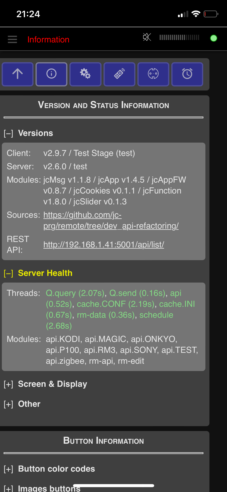

# jc://remote/

With this software you can control several **home media devices** via Infrared and API with a web-app, e.g., on your smartphone.
It requires a small server such as a Raspberry Pi and can control the hardware listed below. 
You can define remote controls for devices and create scenes that use those commands from 
those devices or macros to combine several commands on a single button. 
There are a few templates available to be used and modified.

## Table of Content

- [Currently Supported Hardware](#supported-hardware)
- [Screenshots](#screenshots)
- [Data structure](#data-structure)
- [Main features](#main-feature)
- [Used sources](#used-sources)
- [How to setup the software](#how-to-setup-the-software)
- [Integration of additional APIs and devices](#integration-of-additional-apis-and-devices)
- [Disclaimer](#disclaimer)


## Currently Supported Devices and Interfaces

1. Broadlink Remote Controls  ... [API Info](./server/interfaces/broadlink/README.md)
2. DENON devices with API ... [API Info](./server/interfaces/denon/README.md)
3. KODI server  ... [API Info](./server/interfaces/kodi/README.md)
4. Magic Home compatible LED strips  ... [API Info](./server/interfaces/magichome/README.md)
5. ONKYO devices with API ... [API Info](./server/interfaces/eiscp/README.md)
6. Open Meteo Weather / PyGeo ... [API-Info](./server/interfaces/weather/README.md)
7. SONY devices with API ... [API Info](./server/interfaces/sonyapi/README.md)
8. Tapo SmartPlugs P100 ... [API Info](./server/interfaces/p100/README.md)
9. ZigBee Devices via ZigBee2MQTT API ... [API Info](./server/interfaces/zigbee/README.md)

## Screenshots

         

Find here [further screenshots](./docs/IMPRESSIONS.md) ...

## Data structure

* [Description of data and configuration files](./docs/DATA-STRUCTURE.md)

## Main features

### v3.1 (in progress)

* recording of device and weather data and visualization via Chart.js
* integration of Open Meteo Weather (incl. GeoPy)
* integration of Denon API incl. discovery
* macro editing via app (instead of JSON editing) 

### v3.0

* simple implementation of device groups (use buttons for all devices of a group at the same time)
* integration of ZigBee interface (using a Zigbee USB Dongle and ZigBee2MQTT): Smart Socket + RGB+CCT Bulb + Smart Switch
* schedule events (device commands and macros)
* color picker for RGB, CIE_1391, brightness and color temperature
* RGB+CCT light templates
* improved layout for editing of remotes, and improved JSON editing
* improved setting section and API configuration via app, incl. device discovery for EISCP-ONKYO, KODI, and BROADLINK
* improved adaptive remote layout, e.g., button grid, scaling text in buttons, additional icons and scene headers
* improved error messages for device, scene status, config files, etc.

**Note:** The data structure changed: recreate configuration files by coping them from the 
folder [_sample/devices](data/_sample/devices) to the productive folders and adjusting them to your needs.

### App v2.9 / Server v2.3

* directly view and execute API commands for devices in edit mode
* edit interface configuration via app
* activate and deactivate interfaces
* simplify server configuration (.env), code and REST api refactoring, improve logging

**Note:** The data structure changed: recreate the _00_interface.json_ files by coping them from the 
folder [_sample/devices](data/_sample/devices) to the productive folders.

### App v2.8 / Server v2.1

* toggles to switch on and off devices
* power toggles in scene remotes to switch on/off a power socket for the scene
* optimized UX for editing mode
* moved scene macro editing to the scene remotes
* define automatic "switch off time" for IR devices in config files

### App v2.7 / Server v2.0

* add remote control for LED strips compatible with MagicHome
* add remote control for Tapo SmartPlugs
* add slider and color-picker for remotes
* stabilize API connections
* optimize logging and add error handling for JSON files

### App v2.6 / Server v1.9

* send text input to API for KODI API
* integrate jc://modules/ as sub-module
* integrate jc://app-framework / as sub-module
* Optimize data structure (sample data files, productive files ignored by git)

### App v2.5 / Server v1.9

* add/edit/delete device remote controls via web-client
* add/edit/delete scene remote controls via web-client
* edit remote layouts including preview in the browser
* API for Sony devices (sonyapilib)
* optimized UI (e.g. menu)

### App v2.4 / Server v1.8

* stabled app and API connection incl. better performance
* integrated volume slider
* smaller UI optimizations
* start script including update from GitHub
* cleaned up code

### App v2.3 / Server v1.7

* control devices via API (Onkyo-API, KODI)
* create and edit remote controls for devices (initial)
* record IR commands for devices
* record status for devices controlled via IR (not a direct API)
* read information for devices via API
* light / dark theme based on device preset (Safari)
* basic automatic tests (check data format, check server API requests, check Onkyo-API)
* docker environment for app and server incl. central configuration for multiple stages
* definition of devices and scenes based on a set of JSON files

### App & Server v1.x

* remote control for devices
* remote control for scenes incl. macros
* control devices via IR sender/receiver (Broadlink RM3 Mini)

## Used sources

Many thanks to the authors ...
  
* [BlackBeanControl](https://github.com/davorf/BlackBeanControl)
* [Chart.js](https://www.chartjs.org/)
* [DenonAVR](https://github.com/ol-iver/denonavr)
* [eiscp-onkyo](https://github.com/miracle2k/onkyo-eiscp)
* [KodiJson](https://github.com/jcsaaddupuy/python-kodijson)
* [SonyApiLib](https://https://github.com/alexmohr/sonyapilib)
* [MagicHome API](https://github.com/adamkempenich/magichome-python)
* [Open Meteo](https://open-meteo.com/)
* [PyP100 API](https://github.com/fishbigger/TapoP100)
* [ZigBee2MQTT](https://www.zigbee2mqtt.io/)
* Free icons and images: https://icon-icons.com/, https://www.freeicons.io/, https://www.flaticon.com/, https://icons8.com/, https://unsplash.com/, https://chatgpt.com

Own included modules:

* [jc://modules/](https://github.com/jc-prg/modules)
* [jc://app-framework/](https://github.com/jc-prg/app-framework)


## How to setup the software

### Prerequisites

In order to use jc://remote/ as it is, the following software must be installed:

1. git
2. docker, docker-compose


### How to install, configure and run the software

1. Clone this repository and the modules

    ```bash
    $ git clone https://github.com/jc-prg/remote.git
    $ git submodule update --init
    $ cd remote
    ```

2. Create configuration: [sample.env](./sample.env)

    ```bash
    $ cp sample.env .env
    $ nano .env              # modify configuration for your needs
    ```

3. _Optional:_ Install sample remote controls. Alternatively jump to point (4) to create a fresh configuration and use the app settings to create your own remote controls.

    ```bash
    $ cd data/_sample
    $ ./install-config
    $ cd ../..
    ```

4. Build and start via docker-compose.

    ```bash
    $ docker-compose build
    $ sudo ./start start
    ```

5. Open in browser depending on your settings, e.g., http://localhost:81/

6. To start automatically add the following line to your /etc/rc.local

    ```bash
    /<your_path_to_remote>/start start
    ```

7. Update from Github (works, if configuration file has not changed)

    ```bash
    $ sudo ./start update
    ```

8. Additional options, such as live watching the logging, are available in the start script:

    ```bash
    $ sudo ./start
    ```


## Integration of additional APIs and devices

Additional APIs can be added with a little effort if an API source written in Python is available. 
Find here additional information [how to integrate APIs](./docs/INTERFACES.md).

## Disclaimer

This is a private crafting project. Feel free to try out and improve ... and stay tuned. I'm also open for your contributions.

