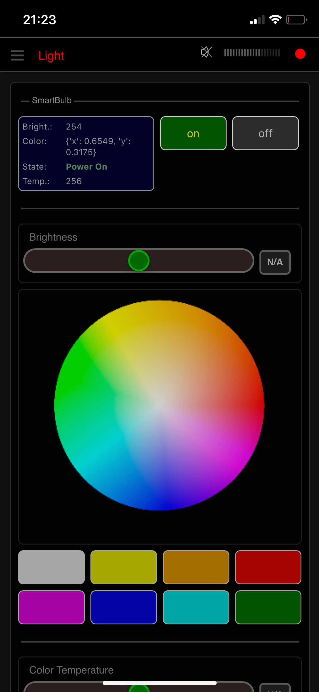

# jc://remote/ - Impressions

## App light theme - remote controls

            

## App light theme - settings

       

## App dark theme - remote controls

          

## App dark theme - remote controls editing

      

## App dark theme - settings

      

## App desktop

    

--------

_[Back to jc://remote/ documentation.](../README.md)_
